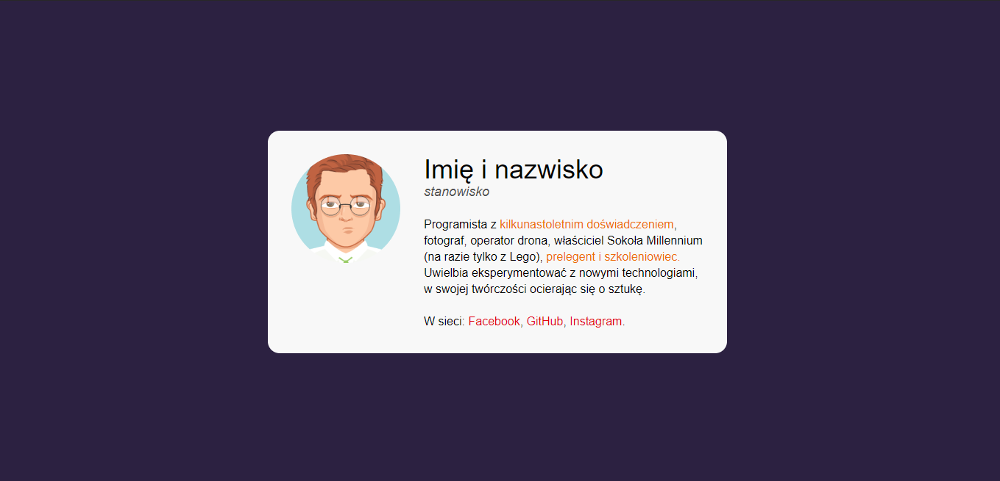

# WTF - Co ten frontend - Business card component solution

## Table of contents

- [Overview](#overview)
  - [Screenshot](#screenshot)
  - [Links](#links)
- [My process](#my-process)
  - [Built with](#built-with)
  - [What I learned](#what-i-learned)

## Overview

It is a profile card created while going through the course: WTF - Co ten frontend. Led by Maciek Korsan. It is one of the first projects to use basic knowledge of HTML and CSS.

### Screenshot

### Links

- Live Site URL: (https://karbowskam.github.io/business-card/)

## My process

### Built with

- Semantic HTML5 markup
- CSS properties
- Flexbox

### What I learned

While creating the project, I learned the basics of using flex. As well as found out why normalize is used.
